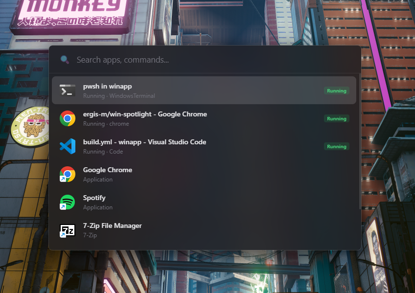

# Win Spotlight

A fast, Raycast-style launcher for Windows. Press **Alt+Space** to open a floating search bar, find apps instantly, search files across your system, and switch between running windows.



## Features

- **Global hotkey** (Alt+Space) to toggle the launcher
- **Fuzzy search** across all installed apps (Start Menu, Desktop, UWP/Store apps)
- **Running windows** shown with a green badge — select to switch focus
- **Usage tracking** — frequently launched apps rise to the top
- **Real app icons** extracted via the Windows Shell API
- **Acrylic blur** background with rounded corners on Windows 11
- **File search** — fuzzy search across indexed directories with smart ranking by recency, file type, and usage frequency
- **Tabbed results** — switch between All, Apps, Files, and Media views
- **Configurable indexing** — choose directories, exclude folders, set depth limits, and rebuild on demand
- **Instant answers** — calculator, unit/currency conversion, color preview, date math, timezone conversion, and percentage helpers directly in the search bar
- **Regional settings** — auto-detected locale with manual overrides for timezone and currency

## Instant Answers

Type directly into the search bar — results appear as you type.

| Category | Examples |
|---|---|
| **Calculator** | `(2+3)*4` · `2^8` · `17 % 5` |
| **Percentage** | `20% of 150` · `what % is 30 of 200` · `100 + 15%` |
| **Unit conversion** | `10kg in lbs` · `100f to c` · `1tb to gb` |
| **Currency** | `100 USD to EUR` · `100 USD` · `50 pounds to yen` |
| **Color preview** | `#ff5733` · `rgb(255,87,51)` · `hsl(11,100%,60%)` · `oklch(...)` |
| **Date math** | `today + 30 days` · `days until Dec 25` · `days between Jan 1 and Mar 15` |
| **Timezone** | `now in Tokyo` · `3pm EST in JST` · `10:30 UTC to PST` |

Currency rates are live from [open.er-api.com](https://open.er-api.com) (160+ currencies). Unit conversion covers length, weight, temperature, volume, speed, data, time, and area. Color input accepts HEX, RGB, HSL, and OKLCH — all formats are shown for easy copying.

## File Search

Search files across your system directly from the launcher. Switch to the **Files** or **Media** tab, or see top file results in the **All** tab.

- **Fuzzy matching** powered by the Skim algorithm — find files even with partial or misspelled names
- **Smart ranking** — results are scored by match relevance, recency, file type, path depth, and how often you open them
- **Cached index** — the file index is persisted to disk for instant startup and rebuilt in the background
- **Media filter** — quickly find images, videos, and audio files in the dedicated Media tab

Configure file search in **Settings → Indexing**:

| Option | Description |
|---|---|
| **Indexed directories** | Choose which folders to scan |
| **Excluded folders** | Skip folders like `node_modules`, `.git`, `dist` |
| **Max depth** | Limit how deep the scanner goes (4–20 levels) |
| **Rebuild index** | Manually trigger a full re-index |

## Settings

Open settings via the gear icon in the launcher footer.

- **General** — Theme (system/light/dark), launch at login, activation shortcut
- **Regional** — Override auto-detected timezone and currency (defaults follow your OS locale)
- **Indexing** — Configure file search directories, exclusions, and depth
- **About** — Version info

## Prerequisites

- [Node.js](https://nodejs.org/) 20+
- [pnpm](https://pnpm.io/) 10+
- [Rust](https://rustup.rs/) stable

## Getting started

```bash
pnpm install
pnpm tauri dev
```

## Building for production

```bash
pnpm tauri build
```

Installers (MSI and NSIS) are output to `src-tauri/target/release/bundle/`.

## Tech stack

- **Backend:** Rust + Tauri 2
- **Frontend:** React + TypeScript + Vite + shadcn/ui
- **Search:** fuzzy-matcher (Skim algorithm)
- **Icons:** Zero-dependency PNG encoder with Windows Shell API extraction
